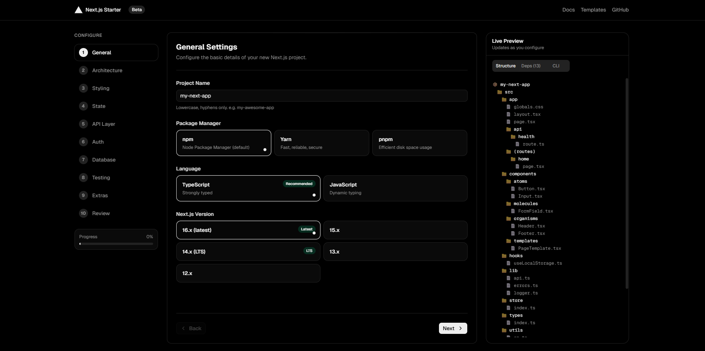

# Next.js Project Generator

A web application that functions similarly to Spring Initializr, but specifically for generating production-ready Next.js projects. It provides a seamless experience for developers to configure, preview, and download a fully scaffolded Next.js project that adheres to modern best practices and scalable architecture.

## Features

- **Configuration:** Configure various project aspects like routing, styling, state management, API layer, authentication, database, ORM, and testing.
- **Scaffolding:** Ensures the generated project follows best practices and a clean folder structure.
- **Preview:** Preview the generated project files and configurations before downloading.
- **Download:** Directly download a fully functional zip file containing your configured Next.js project.

## Tech Stack

The generator itself is built using modern web technologies:

- [Next.js](https://nextjs.org/)
- [Tailwind CSS](https://tailwindcss.com/)
- [shadcn/ui](https://ui.shadcn.com/)
- [Zustand](https://zustand-demo.pmnd.rs/) for state management
- ESLint & Prettier for linting and code formatting

## Getting Started

First, install the dependencies:

```bash
npm install
# or
yarn install
# or
pnpm install
```

Then, run the development server:

```bash
npm run dev
# or
yarn dev
# or
pnpm dev
```

Open [http://localhost:3000](http://localhost:3000) with your browser to see the application in action.

## Available Scripts

In the project directory, you can run:

- `npm run dev` - Starts the development server.
- `npm run build` - Builds the application for production.
- `npm run start` - Starts the production server.
- `npm run lint` - Lints the codebase using ESLint.
- `npm run format` - Formats the codebase using Prettier.
